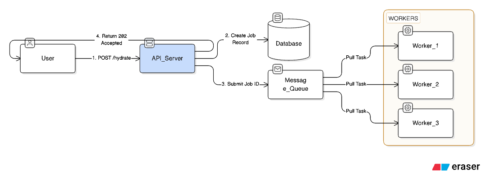
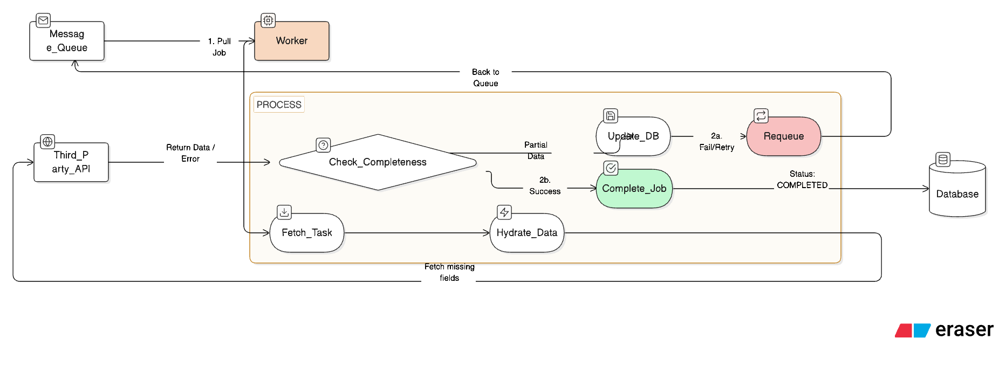

# APPROACH.md

## Integration Gateway — Solution Approach

---

## Architecture Overview



The service is a Go + PostgreSQL backend that enriches foreclosure case records by orchestrating data retrieval from three external sources. The core design principle is that enrichment is fully asynchronous — the API accepts a request and returns immediately, while a background worker handles all external calls and updates state in PostgreSQL as each source completes.

**Key components:**
- REST API (Go `net/http`) — accepts enrichment requests, returns current state
- Worker channel — decouples API from enrichment execution
- Per-source state machine — each source is tracked and retried independently
- PostgreSQL — stores case seed data, enrichment jobs, and per-source state

---

## Data Sources

| Source | Port | Protocol | Failure Modes |
|---|---|---|---|
| Property Records | 9001 | Sync REST/JSON | 503 (transient), 404 (permanent), slow responses (~8s) |
| Court Records | 9002 | Sync JSON → XML | 429 rate limited (Retry-After header), ~3% malformed XML |
| SCRA Military Status | 9003 | Async poll | submit → searchId → poll until complete/error/timeout |

---

## API Design

| Endpoint | Behavior |
|---|---|
| `POST /api/cases/{id}/enrich` | Triggers enrichment. Returns 202 immediately. Idempotent. |
| `GET /api/cases/{id}/enrichment` | Returns current enrichment status and per-source data. |
| `GET /api/cases` | Lists all cases with enrichment status summary. |
| `GET /api/health` | Service health including circuit breaker states. |

---

## Concurrency Model



`POST /api/cases/{id}/enrich` pushes a job onto a worker channel and returns 202 immediately. A pool of background workers picks up jobs and fetches from all applicable sources. Property Records and SCRA can run concurrently per case. Court Records share a global rate limiter across all workers to respect the 2 req/sec limit.

---

## Per-Source State Tracking

Each source is tracked as prefixed columns directly on the `enrichments` row (`pr_*`, `cr_*`, `scra_*`). Since the sources are fixed and known upfront, a separate table adds no value.

| Field | Purpose |
|---|---|
| `status` | `pending / success / failed / not_applicable` |
| `attempts` | Number of attempts made |
| `last_attempt` | Timestamp of last attempt |
| `retry_after` | Absolute time after which next attempt is allowed (from 429 header), null = use default interval |
| `search_id` | SCRA only — stored after submit, used for all subsequent polls |
| `data` | Fetched payload (JSONB) on success, null otherwise |
| `reason` | Failure reason or not_applicable explanation |

**Overall enrichment status:**
- `pending` — at least one source still in progress
- `complete` — all applicable sources succeeded
- `partial` — some succeeded, some failed (recoverable)
- `failed` — all applicable sources failed

---

## Retry Strategy Per Source

### Property Records
```
attempts >= MAX_ATTEMPTS                              → mark failed, stop
attempts < MAX_ATTEMPTS
  AND timeSince(lastAttempt) >= retryAfter ?? DEFAULT_INTERVAL
        200 → success + store data
        404 → failed, no retry (permanent — property not in database)
        503 → increment attempts, update lastAttempt
        429 → increment attempts, store retryAfter from header
```

### Court Records
Same as Property Records plus XML handling:
```
        200 + valid XML       → success + store data
        200 + malformed XML   → increment attempts, retry
        200 + NoFilingFound   → failed, no retry (permanent)
        429                   → increment attempts, store retryAfter from header
```

### SCRA (async polling)
SCRA is not retried on error — it is polled until completion or timeout:
```
searchId = null
  → submit search → store searchId, set attempts = 1

searchId exists
  AND poll attempts < MAX_POLL_ATTEMPTS
  AND timeSince(lastAttempt) >= POLL_INTERVAL
        status = pending  → increment attempts, wait for next poll
        status = complete → success + store data
        status = error    → failed, stop polling (permanent failure)
        404               → failed (invalid searchId)

  AND poll attempts >= MAX_POLL_ATTEMPTS → failed (timed out)
```

The `searchId` is persisted in PostgreSQL so polling can resume correctly if the service restarts mid-poll — no duplicate SCRA submissions.

---

## Idempotency

Calling `POST /api/cases/{id}/enrich` multiple times is safe:

| Existing job state | Behavior |
|---|---|
| No job exists | Create new job, push to worker channel |
| Job in progress | Return current state, do not re-queue |
| Job complete | Return existing result |
| Job partial/failed | Re-queue only the failed sources, skip succeeded ones |

---

## Resilience Patterns

### Retry with backoff
Transient errors (503, 429, malformed XML) are retried with exponential backoff and jitter, capped at `MAX_ATTEMPTS`.

### Rate limit compliance
Court Records is limited to 2 req/sec. A global token bucket rate limiter is shared across all workers so the limit is respected regardless of concurrency level. On 429, the `Retry-After` header value overrides the default interval for that source.

### Circuit breaker
Each external service has an independent circuit breaker. After a threshold of consecutive failures the circuit opens and requests are blocked temporarily. After a cooldown period the circuit moves to half-open and allows one probe request through. Circuit breaker state is visible via `GET /api/health`.

### Timeouts
Each external call has a timeout. Property Records occasionally responds after 8+ seconds — the timeout is set above this to allow for slow-but-valid responses while still bounding worst-case latency.

### Non-retryable errors
- `404` from Property Records — property not in database, permanent
- `NoFilingFound` in Court Records XML — no filing exists, permanent
- `status: error` from SCRA poll — search failed permanently
These are never retried and immediately mark the source as `failed`.

---

## Database Schema

Two tables:

- **`cases`** — seed data loaded from `cases.json` at startup (static reference data)
- **`enrichments`** — one row per case, contains overall status and all per-source fields (status, attempts, last_attempt, retry_after, data, reason) flattened as prefixed columns (`pr_*`, `cr_*`, `scra_*`). Since the sources are fixed and known, a separate table adds no value.

Schema is in `gateway/internal/assets/migrations/001_schema.sql`. Applied automatically at startup via `IF NOT EXISTS` — safe to run repeatedly.

---

## Special Cases

| Case | Handling |
|---|---|
| Cases 1 & 5 | `courtCaseNumber: null` → court records marked `not_applicable` (pre-filing stage) |
| Case 6 | Property records returns 404 → permanent fail, no retry |
| Case 4 | SCRA returns active military duty — data stored as-is, surfaced in enrichment response |

---

## What I Would Add With More Time

- **Temporal workflow orchestration** — replace the channel-based worker with Temporal workflows for durable, resumable enrichment with built-in retry and state persistence
- **Prometheus metrics** — per-source request latency, error rates, circuit breaker state transitions
- **Structured logging with correlation IDs** — trace a single enrichment request across all external calls
- **Bulk enrichment endpoint** — `POST /api/enrich/bulk` with a worker pool and per-case progress reporting
- **Webhook callbacks** — notify a `callbackUrl` when enrichment completes instead of requiring polling
